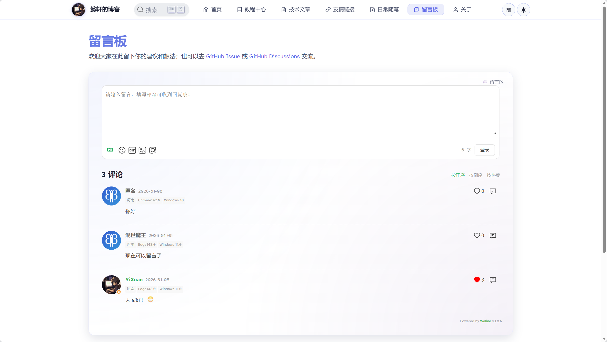

# 🚀 Astro 博客模板

一个功能完善、设计精美的现代化博客模板，基于 Astro 框架构建。

[](LICENSE)
[](https://astro.build)
[](https://nodejs.org)

## 🖼️ 预览

| 首页 | 教程中心 |
| --- | --- |
|  |  |

| 技术文章 | 日常随笔 |
| --- | --- |
|  |  |

| 留言板 | 关于 |
| --- | --- |
|  |  |

## ✨ 特性

- 🎨 **精美设计** - 现代化的 UI 设计，支持亮色/暗色主题自动切换
- 📱 **响应式布局** - 完美适配各种设备屏幕
- ⚡ **极速性能** - 基于 Astro 静态生成，加载速度极快
- 📝 **Markdown 支持** - 使用 Markdown/MDX 编写文章，支持代码高亮
- 🔍 **SEO 优化** - 内置 SEO 优化，支持 sitemap 和 RSS
- 💬 **评论系统** - 集成 Waline 评论系统
- 📊 **内容分类** - 支持文章、教程、笔记等多种内容类型
- 🎯 **目录导航** - 自动生成文章目录，方便快速定位
- 🎵 **音乐播放器** - 内置音乐播放器组件
- 📈 **浏览统计** - 支持文章浏览量统计

## 📦 技术栈

- **框架**: [Astro](https://astro.build) - 现代化的静态站点生成器
- **样式**: CSS3 + CSS Variables（支持主题切换）
- **评论**: [Waline](https://waline.js.org) - 简洁、安全的评论系统
- **图标**: Emoji + SVG
- **部署**: 支持 Vercel、Netlify、GitHub Pages 等

## 🚀 快速开始

### 环境要求

- Node.js >= 18.0.0
- npm 或 pnpm 或 yarn

### 安装

```bash
# 克隆项目
git clone https://github.com/YiXuanHQ/Blog-Template-Astro.git
cd 博客模板仓库

# 安装依赖
npm install
# 或使用 pnpm
pnpm install
```

### 开发

```bash
# 启动开发服务器
npm run dev

# 访问 http://localhost:4321
```

### 构建

```bash
# 构建生产版本
npm run build

# 预览构建结果
npm run preview
```

## ⚙️ 配置

### 基本配置

编辑 `src/consts.ts` 文件，修改网站基本信息：

```typescript
// 网站标题
export const SITE_TITLE = '您的博客标题';

// 网站描述
export const SITE_DESCRIPTION = '您的博客描述';

// Waline 评论服务器地址（可选）
export const WALINE_SERVER_URL = 'https://your-waline-server.com';
```

### 站点配置

编辑 `astro.config.mjs` 文件，修改站点地址：

```javascript
export default defineConfig({
	site: 'https://your-domain.com',  // 修改为您的域名
	// ...其他配置
});
```

### 个人信息配置

修改以下文件以自定义个人信息：

1. **关于页面** - `src/pages/about.astro`
2. **首页** - `src/pages/index.astro`
3. **头像和图片** - 替换 `public/` 目录下的图片文件

## 📝 内容管理

### 文章结构

项目支持多种内容类型，位于 `src/content/` 目录：

```
src/content/
├── articles/      # 技术文章
├── tutorials/     # 系统教程
├── diary/         # 日常随笔
└── config.ts      # 内容配置
```

### 创建文章

在相应目录创建 `.md` 或 `.mdx` 文件：

```markdown
---
title: '文章标题'
description: '文章描述'
pubDate: 2024-01-20
heroImage: '/blog-placeholder.jpg'
---

文章内容...
```

### 创建教程系列

教程支持章节结构，在 `src/content/tutorials/` 下创建目录和文件：

```
tutorials/
└── 你的教程名/
    ├── README.md           # 教程首页
    ├── 第1章/
    │   └── 内容.md
    └── 第2章/
        └── 内容.md
```

## 🎨 自定义主题

### 颜色变量

编辑 `src/styles/global.css` 修改主题颜色：

```css
:root {
	--color-primary: #5d67e8;
	--color-primary-dark: #4a54d1;
	--color-text: #2c3e50;
	--color-bg: #ffffff;
	/* ...更多变量 */
}
```

### 暗色主题

暗色主题会根据系统设置自动切换，也可以自定义暗色主题变量：

```css
[data-theme="dark"] {
	--color-text: #ffffff;
	--color-bg: #1a1a1a;
	/* ...更多变量 */
}
```

## 📁 项目结构

```
├── public/              # 静态资源
│   ├── avatar.png       # 头像
│   ├── favicon.svg      # 网站图标
│   └── music/           # 音乐文件
├── src/
│   ├── components/      # 组件
│   ├── content/         # 内容文件
│   ├── layouts/         # 布局组件
│   ├── pages/           # 页面
│   ├── styles/          # 样式文件
│   └── consts.ts        # 配置常量
├── astro.config.mjs     # Astro 配置
└── package.json         # 项目配置
```

## 🔧 高级配置

### 评论系统

本模板使用 Waline 评论系统。配置步骤：

1. 部署 Waline 服务端（参考 [Waline 文档](https://waline.js.org/guide/get-started.html)）
2. 在 `src/consts.ts` 中配置服务器地址
3. 评论会自动显示在文章页面底部

### 搜索功能（可选）

模板预留了 Algolia 搜索配置，在 `src/consts.ts` 中配置：

```typescript
export const algolia = {
	appId: 'YOUR_APP_ID',
	apiKey: 'YOUR_API_KEY',
	indices: ['your_index_name'],
	// ...其他配置
};
```

## 🚀 部署

### Vercel（推荐）

1. 将代码推送到 GitHub
2. 在 [Vercel](https://vercel.com) 导入项目
3. Vercel 会自动检测 Astro 并完成部署

### Netlify

1. 将代码推送到 GitHub
2. 在 [Netlify](https://netlify.com) 导入项目
3. 构建命令：`npm run build`
4. 发布目录：`dist`

### GitHub Pages

```bash
# 修改 astro.config.mjs
export default defineConfig({
	site: 'https://username.github.io',
	base: '/repo-name',
});

# 构建并部署
npm run build
# 将 dist 目录内容推送到 gh-pages 分支
```

## 📄 许可证

本项目采用 [MIT](LICENSE) 许可证。

## 🤝 贡献

欢迎提交 Issue 和 Pull Request！

## 💖 鸣谢

- [Astro](https://astro.build) - 强大的静态站点生成器
- [Waline](https://waline.js.org) - 简洁的评论系统
- 所有贡献者和使用者

## 📞 联系方式

如有问题或建议，欢迎通过以下方式联系：

- 提交 [Issue](https://github.com/YiXuanHQ/Blog-Template-Astro/issues)
- 发送邮件至：byyi.xuan@outlook.com

---

**如果这个项目对你有帮助，欢迎 ⭐ Star 支持！**
