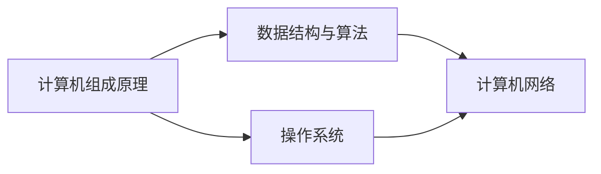

# 📚 计算机基础

> 夯实计算机基础，理解底层原理

## 📖 模块导航

### [计算机组成原理](computer-organization/)
- 计算机系统概述
- 数据的表示与运算
- 存储器层次结构
- 指令系统
- CPU设计

### [数据结构与算法](data-structures/)
- 线性表
- 栈与队列
- 树与二叉树
- 图
- 排序与查找算法

### [计算机网络](network/)
- 网络体系结构
- 物理层
- 数据链路层
- 网络层
- 传输层
- 应用层

### [操作系统](operating-system/)
- 操作系统概述
- 进程管理
- 内存管理
- 文件系统
- I/O管理

## 🎯 学习路线

## 💡 学习建议

1. **先理论后实践** - 理解基本概念后再动手实现
2. **画图辅助理解** - 用图表理解抽象概念
3. **刷题巩固** - 通过算法题巩固数据结构知识
4. **系统学习** - 按照推荐顺序循序渐进

## 🔗 相关资源

- [LeetCode算法练习](https://leetcode.cn/)
- [牛客网面试题库](https://www.nowcoder.com/)
- 《深入理解计算机系统》(CSAPP)
- 《算法导论》

---

**开始学习** → [选择一个模块开始](./)
