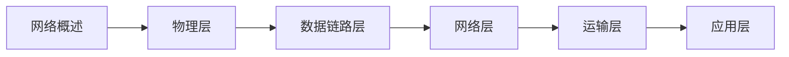

---
title: ---
---

---
title: 计算机网络教程
autoGroup: false
autoSort: false
sidebarDepth: 0
---

# 计算机网络教程

> 🌐 **系统化计算机网络学习** | 从原理到实践 | 包含面试高频考点
> 
> 💡 **使用建议**：理解网络分层架构，掌握各层协议原理

---

## 📖 教程结构

### 第一章：计算机网络概述
> 理解计算机网络的基本概念和体系结构

| 序号 | 章节 | 核心内容 | 面试频率 |
|------|------|----------|----------|
| 01 | [计算机网络概述](./第1章%20概述.md) | 网络发展、体系结构、性能指标 | ⭐⭐⭐⭐ |

**学习目标：**
- ✅ 理解计算机网络的基本概念
- ✅ 掌握OSI和TCP/IP体系结构
- ✅ 了解网络性能指标

**重点面试题：**
- OSI七层模型和TCP/IP四层模型
- 网络时延的组成
- 网络性能指标（带宽、吞吐量、时延）

---

### 第二章：物理层
> 掌握数据通信的基本原理

| 序号 | 章节 | 核心内容 | 面试频率 |
|------|------|----------|----------|
| 02 | [物理层](./第2章%20物理层.md) | 数据通信、传输媒体、信道复用 | ⭐⭐⭐ |

**学习目标：**
- ✅ 理解数据通信的基本概念
- ✅ 掌握传输媒体的特性
- ✅ 了解信道复用技术

**重点面试题：**
- 数据传输速率和带宽
- 基带传输和宽带传输
- 信道复用技术（FDM、TDM、WDM、CDM）

---

### 第三章：数据链路层
> 理解数据帧的传输和差错控制

| 序号 | 章节 | 核心内容 | 面试频率 |
|------|------|----------|----------|
| 03 | [数据链路层](./第3章%20数据链路层.md) | 成帧、差错检测、流量控制、MAC协议 | ⭐⭐⭐⭐⭐ |

**学习目标：**
- ✅ 理解数据链路层的功能
- ✅ 掌握差错检测方法
- ✅ 了解MAC协议和以太网

**重点面试题：**
- 数据链路层的三个基本问题
- CRC循环冗余检验
- 停止-等待协议、滑动窗口协议
- CSMA/CD协议
- 以太网帧格式
- 交换机和集线器的区别

---

### 第四章：网络层
> 深入理解IP协议和路由算法

| 序号 | 章节 | 核心内容 | 面试频率 |
|------|------|----------|----------|
| 04 | [网络层](./第4章%20网络层.md) | IP协议、路由算法、ICMP、ARP | ⭐⭐⭐⭐⭐ |

**学习目标：**
- ✅ 理解IP地址和子网划分
- ✅ 掌握路由选择算法
- ✅ 了解NAT和ICMP协议

**重点面试题：**
- IP地址分类和子网划分
- ARP协议工作原理
- ICMP协议（ping、traceroute）
- 路由算法（RIP、OSPF、BGP）
- NAT工作原理
- IPv4和IPv6的区别

---

### 第五章：运输层
> 掌握TCP和UDP协议

| 序号 | 章节 | 核心内容 | 面试频率 |
|------|------|----------|----------|
| 05 | [运输层](./第5章%20运输层.md) | UDP、TCP、流量控制、拥塞控制 | ⭐⭐⭐⭐⭐ |

**学习目标：**
- ✅ 理解TCP和UDP的区别
- ✅ 掌握TCP三次握手和四次挥手
- ✅ 了解TCP流量控制和拥塞控制

**重点面试题：**
- TCP和UDP的区别
- TCP三次握手过程
- TCP四次挥手过程
- TCP流量控制（滑动窗口）
- TCP拥塞控制（慢开始、拥塞避免、快重传、快恢复）
- TIME_WAIT状态的作用

---

### 第六章：应用层
> 学习常用应用层协议

| 序号 | 章节 | 核心内容 | 面试频率 |
|------|------|----------|----------|
| 06 | [应用层](./第6章%20应用层.md) | DNS、HTTP、HTTPS、FTP、SMTP | ⭐⭐⭐⭐⭐ |

**学习目标：**
- ✅ 理解DNS域名解析过程
- ✅ 掌握HTTP协议
- ✅ 了解HTTPS加密原理

**重点面试题：**
- DNS解析过程
- HTTP和HTTPS的区别
- HTTP请求方法（GET、POST等）
- HTTP状态码
- Cookie和Session
- HTTPS加密原理（对称加密、非对称加密）
- HTTP/1.1和HTTP/2的区别

---

## 🎯 学习路线建议

### 🔰 基础学习路线（2-3个月）


**推荐学习顺序：**
1. 第一章：网络概述（1周）- 建立整体认知
2. 第二章：物理层（1周）- 了解底层传输
3. 第三章：数据链路层（2周）- **重点**：MAC协议
4. 第四章：网络层（2周）- **重点**：IP协议和路由
5. 第五章：运输层（3周）- **重点**：TCP协议
6. 第六章：应用层（2周）- **重点**：HTTP/HTTPS

### 🚀 进阶学习路线
```
网络基础 → 网络编程 → 网络安全 → 实战项目
```

---

## 📝 面试高频考点汇总

### ⭐⭐⭐⭐⭐ 必考考点
1. **OSI七层模型和TCP/IP四层模型**
2. **TCP三次握手和四次挥手**
3. **TCP和UDP的区别**
4. **HTTP和HTTPS的区别**
5. **TCP流量控制和拥塞控制**
6. **IP地址分类和子网划分**
7. **ARP协议工作原理**
8. **DNS解析过程**
9. **HTTP状态码**
10. **Cookie和Session的区别**

### ⭐⭐⭐⭐ 常考考点
1. **CSMA/CD协议**
2. **以太网帧格式**
3. **交换机和路由器的区别**
4. **ICMP协议（ping）**
5. **NAT工作原理**
6. **路由算法（RIP、OSPF）**
7. **滑动窗口协议**
8. **TIME_WAIT状态**
9. **HTTP请求方法**
10. **HTTPS加密原理**

### ⭐⭐⭐ 了解即可
1. **信道复用技术**
2. **CRC循环冗余检验**
3. **IPv6特性**
4. **BGP协议**
5. **HTTP/2和HTTP/3**

---

## 💡 学习建议

### ✅ 推荐做法
1. **自底向上学习** - 从物理层到应用层逐层理解
2. **画图辅助** - 多画协议栈图、数据封装图
3. **抓包实践** - 使用Wireshark分析网络数据包
4. **做题巩固** - 通过习题加深理解
5. **联系实际** - 结合实际应用场景理解协议

### ❌ 避免误区
1. ❌ 只记协议名称不理解原理
2. ❌ 忽视TCP的重要性
3. ❌ 没有动手抓包分析
4. ❌ 孤立学习，不理解分层思想

---

## 🛠️ 实践工具

### 网络抓包工具
- **Wireshark** - 网络协议分析工具
- **tcpdump** - 命令行抓包工具
- **Fiddler** - HTTP抓包工具

### 网络测试命令
```bash
ping <host>          # 测试网络连通性
traceroute <host>    # 跟踪路由路径
netstat -an          # 查看网络连接
nslookup <domain>    # DNS查询
curl -v <url>        # HTTP请求测试
```

### 网络编程
```python
# Python Socket编程
import socket

# TCP服务端
server = socket.socket(socket.AF_INET, socket.SOCK_STREAM)
server.bind(('localhost', 8080))
server.listen(5)

# TCP客户端
client = socket.socket(socket.AF_INET, socket.SOCK_STREAM)
client.connect(('localhost', 8080))
```

---

## 📚 推荐资源

### 书籍推荐
- 《计算机网络》- 谢希仁（经典教材）
- 《计算机网络：自顶向下方法》
- 《TCP/IP详解 卷1：协议》
- 《图解HTTP》
- 《图解TCP/IP》

### 在线资源
- [RFC文档](https://www.rfc-editor.org/) - 网络协议标准
- [Wireshark官方教程](https://www.wireshark.org/docs/)

### 视频课程
- 哈工大计算机网络课程
- 中国大学MOOC - 计算机网络

---

## 📊 学习进度追踪

### 基础阶段 ✅
- [ ] 第一章：计算机网络概述
- [ ] 第二章：物理层

### 核心阶段 🔄
- [ ] 第三章：数据链路层（重点）
- [ ] 第四章：网络层（重点）
- [ ] 第五章：运输层（重点）

### 应用阶段 ⏳
- [ ] 第六章：应用层（重点）
- [ ] Wireshark抓包实践
- [ ] Socket网络编程

---

**开始学习** → [第一章 - 计算机网络概述](./第1章%20概述.md)
