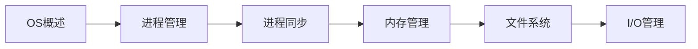

---
title: ---
---

---
title: 操作系统教程
autoGroup: false
autoSort: false
sidebarDepth: 0
---

# 操作系统教程

> ⚙️ **系统化操作系统学习** | 从原理到实践 | 包含面试高频考点
> 
> 💡 **使用建议**：注重理解OS核心机制，结合Linux系统实践

---

## 📖 教程结构

### 第一章：操作系统概述
> 理解操作系统的基本概念和功能

| 序号 | 章节 | 核心内容 | 面试频率 |
|------|------|----------|----------|
| 01 | [操作系统概述](basic/introduction.md) | OS功能、特征、发展历史、体系结构 | ⭐⭐⭐⭐ |

**学习目标：**
- ✅ 理解操作系统的基本概念
- ✅ 掌握操作系统的主要功能
- ✅ 了解操作系统的发展历程

**重点面试题：**
- 操作系统的主要功能
- 内核态和用户态的区别
- 系统调用的过程

---

### 第二章：进程管理
> 掌握进程和线程的核心概念

| 序号 | 章节 | 核心内容 | 面试频率 |
|------|------|----------|----------|
| 02 | [进程与线程](basic/process.md) | 进程概念、状态转换、调度算法、线程 | ⭐⭐⭐⭐⭐ |

**学习目标：**
- ✅ 理解进程的概念和状态
- ✅ 掌握进程调度算法
- ✅ 理解进程和线程的区别

**重点面试题：**
- 进程和线程的区别
- 进程的五种状态及转换
- 进程调度算法（FCFS、SJF、RR、优先级）
- 进程间通信方式（IPC）
- 线程的实现方式

---

### 第三章：进程同步
> 理解并发控制和死锁问题

| 序号 | 章节 | 核心内容 | 面试频率 |
|------|------|----------|----------|
| 03 | [进程同步](core/sync.md) | 临界区、信号量、管程、死锁 | ⭐⭐⭐⭐⭐ |

**学习目标：**
- ✅ 理解临界区和互斥
- ✅ 掌握信号量机制
- ✅ 理解死锁的条件和处理

**重点面试题：**
- 进程同步和互斥的区别
- 信号量的P、V操作
- 生产者-消费者问题
- 读者-写者问题
- 哲学家就餐问题
- 死锁的四个必要条件
- 死锁的预防、避免、检测和解除
- 银行家算法

---

### 第四章：内存管理
> 深入理解内存分配和虚拟内存

| 序号 | 章节 | 核心内容 | 面试频率 |
|------|------|----------|----------|
| 04 | [内存管理](core/memory.md) | 分页、分段、虚拟内存、页面置换 | ⭐⭐⭐⭐⭐ |

**学习目标：**
- ✅ 理解内存分配策略
- ✅ 掌握分页和分段机制
- ✅ 理解虚拟内存原理

**重点面试题：**
- 分页和分段的区别
- 虚拟内存的概念和作用
- 页面置换算法（FIFO、LRU、Clock）
- 页表和快表（TLB）
- 内存碎片问题

---

### 第五章：文件系统
> 学习文件的组织和管理

| 序号 | 章节 | 核心内容 | 面试频率 |
|------|------|----------|----------|
| 05 | [文件系统](core/filesystem.md) | 文件结构、目录、磁盘管理 | ⭐⭐⭐⭐ |

**学习目标：**
- ✅ 理解文件的逻辑结构
- ✅ 掌握目录结构
- ✅ 了解磁盘空间管理

**重点面试题：**
- 文件的物理结构（连续、链接、索引）
- inode的作用
- 软链接和硬链接的区别
- 磁盘调度算法（FCFS、SSTF、SCAN、C-SCAN）

---

### 第六章：I/O管理
> 掌握设备管理和I/O控制

| 序号 | 章节 | 核心内容 | 面试频率 |
|------|------|----------|----------|
| 06 | [设备管理](core/device.md) | I/O控制方式、设备驱动、缓冲 | ⭐⭐⭐ |

**学习目标：**
- ✅ 了解I/O控制方式
- ✅ 理解设备驱动原理
- ✅ 掌握缓冲技术

**重点面试题：**
- I/O控制方式（程序控制、中断、DMA）
- 缓冲的作用
- SPOOLing技术

---

## 🎯 学习路线建议

### 🔰 基础学习路线（2-3个月）


**推荐学习顺序：**
1. 第一章：OS概述（1周）- 建立整体认知
2. 第二章：进程管理（2周）- **重点**：进程调度
3. 第三章：进程同步（2周）- **重点**：死锁
4. 第四章：内存管理（2周）- **重点**：虚拟内存
5. 第五章：文件系统（1周）- 文件组织
6. 第六章：I/O管理（1周）- I/O控制

### 🚀 进阶学习路线
```
OS基础 → Linux系统编程 → 内核源码阅读 → 实战项目
```

---

## 📝 面试高频考点汇总

### ⭐⭐⭐⭐⭐ 必考考点
1. **进程和线程的区别**
2. **进程的状态转换**
3. **进程调度算法**
4. **进程间通信方式（IPC）**
5. **死锁的四个必要条件**
6. **死锁处理方法**
7. **分页和分段的区别**
8. **虚拟内存原理**
9. **页面置换算法（LRU、FIFO）**
10. **生产者-消费者问题**

### ⭐⭐⭐⭐ 常考考点
1. **内核态和用户态**
2. **系统调用**
3. **信号量的P、V操作**
4. **读者-写者问题**
5. **哲学家就餐问题**
6. **银行家算法**
7. **快表（TLB）**
8. **文件的物理结构**
9. **软链接和硬链接**
10. **磁盘调度算法**

### ⭐⭐⭐ 了解即可
1. **操作系统的发展历史**
2. **实时系统**
3. **分布式系统**
4. **SPOOLing技术**

---

## 💡 学习建议

### ✅ 推荐做法
1. **理解为主** - 重点理解OS的设计思想和工作机制
2. **画图辅助** - 多画状态转换图、时序图
3. **实践验证** - 在Linux上实践进程、线程操作
4. **做题巩固** - 通过经典问题加深理解
5. **对比学习** - 对比不同算法的优缺点

### ❌ 避免误区
1. ❌ 只记结论不理解过程
2. ❌ 忽视经典同步问题
3. ❌ 没有动手实践
4. ❌ 孤立学习，不联系实际系统

---

## 🛠️ 实践工具

### Linux系统编程
```c
// 进程创建
fork();

// 线程创建  
pthread_create();

// 进程通信
pipe(), msgget(), shmget();

// 文件操作
open(), read(), write();
```

### 常用命令
```bash
ps -ef          # 查看进程
top             # 系统监控
free -h         # 内存使用
df -h           # 磁盘使用
```

---

## 📚 推荐资源

### 书籍推荐
- 《操作系统概念》(Operating System Concepts) - 恐龙书
- 《现代操作系统》- Andrew S. Tanenbaum
- 《深入理解计算机系统》(CSAPP)
- 《Linux内核设计与实现》
- 《Unix环境高级编程》(APUE)

### 在线资源
- [Linux man pages](https://man7.org/linux/man-pages/)
- [清华大学操作系统课程](https://www.xuetangx.com/)

### 视频课程
- 哈工大操作系统课程
- 中国大学MOOC - 操作系统

---

## 📊 学习进度追踪

### 基础阶段 ✅
- [ ] 第一章：操作系统概述
- [ ] 第二章：进程管理（重点）

### 核心阶段 🔄
- [ ] 第三章：进程同步（重点）
- [ ] 第四章：内存管理（重点）

### 进阶阶段 ⏳
- [ ] 第五章：文件系统
- [ ] 第六章：I/O管理
- [ ] Linux系统编程实践

---

**开始学习** → [第一章 - 操作系统概述](basic/introduction.md)
